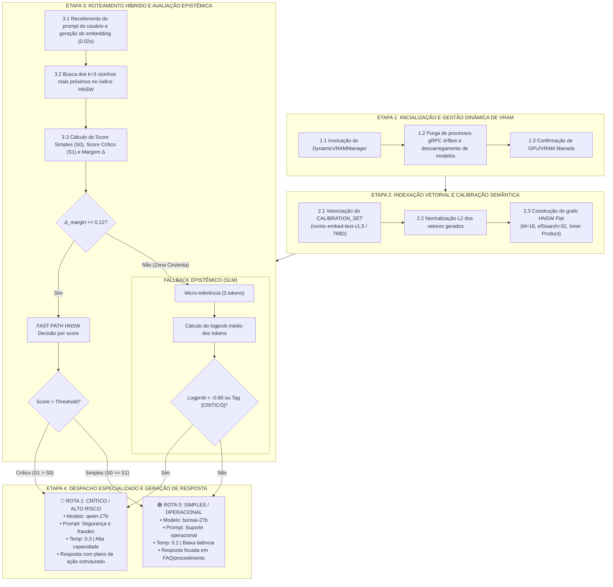

# Smart LLM Router 🚦🧠

> Roteador semântico híbrido e adaptativo para otimização de recursos computacionais e inferência de LLMs locais. Combina busca vetorial aproximada em grafos (HNSW com FAISS), inspeção epistêmica por incerteza (logprobs) em SLM e gerenciamento dinâmico de VRAM no LocalAI via Docker.


https://github.com/user-attachments/assets/3d0512ab-9443-4bac-a0c9-c2d0cfb4a2df


---

## 📌 Visão Geral e Maximização de Utilidade

Em arquiteturas de atendimento ao cliente e processamento de linguagem natural, submeter todas as requisições a modelos de grande porte (Large Language Models - LLMs) impõe alto consumo de VRAM e latência desnecessária para dúvidas triviais. Por outro lado, depender unicamente de modelos compactos (Small Language Models - SLMs) introduz riscos inaceitáveis em ocorrências de alta criticidade (como fraudes, contestações financeiras e vazamento de credenciais).

O **Smart LLM Router** maximiza o retorno utilitário de cada ciclo de GPU por meio de uma triagem em múltiplos estágios:

1. **Fast-Path HNSW (Busca Vetorial Ultrarrápida):**
   Gera embeddings normalizados do prompt e consulta os $k=3$ vizinhos mais próximos no índice HNSW (`faiss.IndexHNSWFlat`). Se a margem de separação entre as classes de intenção atingir o limiar de confiança ($\Delta_{\text{margin}} \ge 0.12$), o roteamento é concluído em poucos milissegundos sem alocação adicional de inferência.

2. **Fallback Epistêmico via SLM Gated (Inspeção de Incerteza por Logprobs):**
   Em regiões de fronteira ou ambiguidade semântica ($\Delta_{\text{margin}} < 0.12$), o sistema aciona uma micro-inferência (3 tokens) no modelo leve (`bonsai-27b`). A incerteza do modelo é calculada a partir da média de `logprobs`. Se a média estiver abaixo do limiar de segurança (`LOGPROB_THRESHOLD = -0.80`) ou se a tag `[CRITICO]` for gerada, o sistema aplica uma política defensiva assimétrica direcionando para a rota de alta capacidade.

3. **Gerenciamento Dinâmico de VRAM (`DynamicVRAMManager`):**
   Garante máxima eficiência no uso de hardware ao permitir a alternância sob demanda entre modelos pesados e leves em GPUs com restrição de memória (ex: 12 GB). O gerenciador monitora as sessões, purga processos gRPC órfãos e descarrega modelos anteriores no container `dynamic-llama-server` via API do LocalAI e sinais de sistema.

---
## 🗺️ Fluxograma Metodológico Completo

A figura a seguir detalha o fluxo completo de 4 etapas que compõem o ciclo de execução do sistema:




## ⚙️ Variáveis de Ambiente e Configuração

O roteador pode ser parametrizado via variáveis de ambiente no arquivo `.env` ou exportadas no shell:

| Variável | Valor Padrão | Descrição |
| :--- | :--- | :--- |
| `LLAMA_SERVER_URL` | `http://localhost:8080` | Endpoint base do servidor LocalAI / Llama Server |
| `API_KEY` | `local-no-key` | Chave de autenticação da API (quando exigida) |
| `MODEL_EMBED` | `text-embedding` | Modelo para geração de vetores semânticos |
| `MODEL_CHEAP` | `bonsai-27b` | Modelo leve (SLM) para triagem e dúvidas simples |
| `MODEL_EXPENSIVE` | `qwen-27b` | Modelo de alta capacidade para ocorrências críticas |
| `ROUTER_MARGIN_THRESHOLD` | `0.12` | Limiar mínimo de margem HNSW para decisão no Fast-Path |
| `ROUTER_LOGPROB_THRESHOLD` | `-0.80` | Limiar de logprob médio do SLM para classificar certeza |

---

## 🧰 Estrutura de Modelos e LocalAI

Os modelos são configurados na pasta `models/` e consumidos pelo container Docker com suporte a aceleração por hardware (GPU/VRAM):

* `models/nomic-embed.yaml` → Configuração do backend `text-embedding` (`nomic-embed.gguf`).
* `models/bonsai.yaml` → Configuração do backend `bonsai-27b` (`bonsai-27b.gguf`).
* `models/qwen.yaml` → Configuração do backend `qwen-27b` (`qwen-27b.gguf`).

---

## 📁 Estrutura do Projeto

A base de código adota uma arquitetura em camadas modular e desacoplada:

```text
smart-llm-router/
├── src/smart_router/
│   ├── domain/           # Entidades, enums e contratos de domínio
│   ├── config/           # Gestão tipada de configurações e ambiente (Settings)
│   ├── infrastructure/   # Gerenciamento de VRAM, indexação vetorial (FAISS HNSW) e cliente LLM
│   ├── application/      # Serviços de roteamento rápido, triagem epistêmica e orquestração
│   └── presentation/     # Renderizador de console ANSI e interface CLI
├── tests/                # Suíte de testes unitários automatizados
├── models/               # Manifestos de configuração e pesos GGUF
├── docker-compose.yml    # Orquestração do servidor LocalAI em container
└── smart_router.py       # Ponto de entrada e compatibilidade da aplicação
```

---

## 📦 Instalação e Pré-requisitos

### 📋 Requisitos do Sistema
* **Hardware:** GPU ou Acelerador com no mínimo **12 GB de VRAM** (ou memória unificada/RAM equivalente para suportar o gerenciamento dinâmico e execução dos modelos quantizados).
* **Docker & Docker Compose:** Container runtime com suporte a aceleração por hardware/GPU configurado.
* **Python:** `>= 3.13`
* **Gerenciador de Pacotes:** `uv`
* **Make:** Para execução simplificada dos comandos de orquestração.

---

### 1. Download dos Modelos GGUF

Os arquivos de pesos `.gguf` devem ser baixados e salvos no diretório `models/`, correspondendo às configurações definidas nos arquivos `.yaml`:

```bash
# Garantir que o diretório de modelos exista
mkdir -p models

# 1. Modelo de Embeddings (nomic-embed-text-v1.5)
curl -L "https://huggingface.co/nomic-ai/nomic-embed-text-v1.5-GGUF/resolve/main/nomic-embed-text-v1.5.Q4_K_M.gguf" -o models/nomic-embed.gguf

# 2. SLM Leve / Triagem Epistêmica (Bonsai 27B 1-bit / ~3.9 GB)
curl -L "https://huggingface.co/prism-ml/Bonsai-27B-gguf/resolve/main/Bonsai-27B-Q1_0.gguf" -o models/bonsai-27b.gguf

# 3. LLM Crítico / Alta Capacidade (Qwen 27B Q4_K_M / ~17.4 GB ou IQ2_XXS / ~8.9 GB)
curl -L "https://huggingface.co/unsloth/Qwen3.6-27B-GGUF/resolve/main/Qwen3.6-27B-Q4_K_M.gguf" -o models/qwen-27b.gguf
```


---

### 2. Inicializar Infraestrutura e Dependências

Com os modelos baixados na pasta `models/`, inicialize o container e sincronize o ambiente Python:

```bash
# Sobe o container LocalAI e sincroniza dependências com uv
make up
```

Ou execute manualmente via Docker Compose e `uv`:

```bash
docker compose up -d
uv sync
```

---

## 🚀 Execução

Execute o roteador inteligente com:

```bash
uv run python smart_router.py
```

### Fluxo de Execução:
1. **Inicialização do Ambiente:** A GPU é limpa e a VRAM é descarregada via `DynamicVRAMManager`.
2. **Indexação HNSW:** Calibração inicial do espaço vetorial com o conjunto de referência (`CALIBRATION_SET`).
3. **Bateria de Testes Automatizada:** Demonstração de classificação direta e resolução de casos de teste.
4. **Terminal Interativo:** Sessão de chat contínuo com chaveamento dinâmico de modelos e feedback em tempo real no terminal.

Para encerrar o chat interativo, digite `sair`, `exit` ou envie um sinal de interrupção (`Ctrl+C`). O manipulador de sinais garante a ejeção dos modelos da GPU ao sair.

---

## 🧪 Estratégia de Fallback e Segurança (Fail-Safe)

* **Detecção de Incerteza:** Ambiguidade semântica dispara automaticamente a análise de entropia/logprob no SLM.
* **Fail-Safe Assimétrico:** Na ausência de `logprobs` ou em caso de qualquer falha na inferência leve, a consulta é redirecionada preventivamente para a **Rota Crítica** (`qwen-27b`), assegurando prioridade máxima à integridade da resposta.
* **Liberação de Recursos:** Desalocação forçada entre transições de modelo e encerramento limpo via `atexit` e `signal`.

---

## 📖 Referências Bibliográficas

* **CHEN, L.; ZAHARIA, M.; ZOU, J.** *FrugalGPT: How to Use Large Language Models Cheaply and Effectively*. arXiv preprint arXiv:2305.05176, 2023. Disponível em: <https://arxiv.org/abs/2305.05176>.
* **DING, D. et al.** *Hybrid LLM: Cost-Efficient and Quality-Aware Query Routing*. In: International Conference on Learning Representations (ICLR), 2024. Disponível em: <https://arxiv.org/abs/2404.14618>.
* **GERGANOV, G. et al.** *llama.cpp: Port of Facebook's LLaMA model in C/C++*. 2023. Disponível em: <https://github.com/ggerganov/llama.cpp>.
* **HU, Q. et al.** *RouterBench: A Benchmark for Multi-LLM Routing System*. arXiv preprint arXiv:2403.12031, 2024. Disponível em: <https://arxiv.org/abs/2403.12031>.
* **JOHNSON, J.; DOUZE, M.; JÉGOU, H.** *Billion-scale similarity search with GPUs*. IEEE Transactions on Big Data, v. 7, n. 3, p. 535-547, 2019. Disponível em: <https://arxiv.org/abs/1702.08734>.
* **KADAVATH, S. et al.** *Language Models (Mostly) Know What They Know*. arXiv preprint arXiv:2207.05221, Anthropic, 2022. Disponível em: <https://arxiv.org/abs/2207.05221>.
* **KUHN, L.; GAL, Y.; FARQUHAR, S.** *Semantic Uncertainty: Linguistic Invariances for Uncertainty Estimation in Large Language Models*. In: International Conference on Learning Representations (ICLR), 2023. Disponível em: <https://arxiv.org/abs/2302.09664>.
* **MALKOV, Y. A.; YASHUNIN, D. A.** *Efficient and robust approximate nearest neighbor search using Hierarchical Navigable Small World graphs*. IEEE Transactions on Pattern Analysis and Machine Intelligence (TPAMI), v. 42, n. 4, p. 824-836, 2020. Disponível em: <https://doi.org/10.1109/TPAMI.2018.2889473>.
* **MUDLER, E. et al.** *LocalAI: The free, Open Source OpenAI alternative*. 2023. Disponível em: <https://github.com/mudler/LocalAI>.
* **NUSSBAUM, Z. et al.** *Nomic Embed: Training a Reproducible Long Context Text Embedder*. arXiv preprint arXiv:2402.01613, 2024. Disponível em: <https://arxiv.org/abs/2402.01613>.
* **ONG, I. et al.** *RouteLLM: Learning to Route LLMs with Preference Data*. arXiv preprint arXiv:2406.18665, 2024. Disponível em: <https://arxiv.org/abs/2406.18665>.
* **PRISM ML.** *Bonsai-27B: Extreme 1-bit Quantized Language Model*. Hugging Face Model Hub, 2024. Disponível em: <https://huggingface.co/prism-ml/Bonsai-27B-gguf>.
* **YANG, A. et al.** *Qwen2 Technical Report*. arXiv preprint arXiv:2407.10671, 2024. Disponível em: <https://arxiv.org/abs/2407.10671>.

---

## 📄 Licença

Este projeto é distribuído sob a licença MIT. Consulte o arquivo `LICENSE` para mais detalhes.
